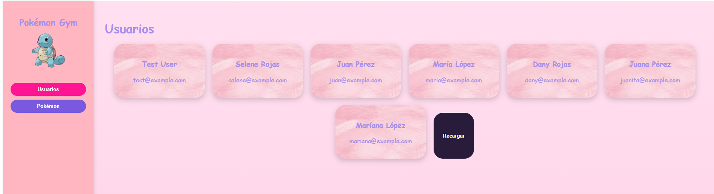
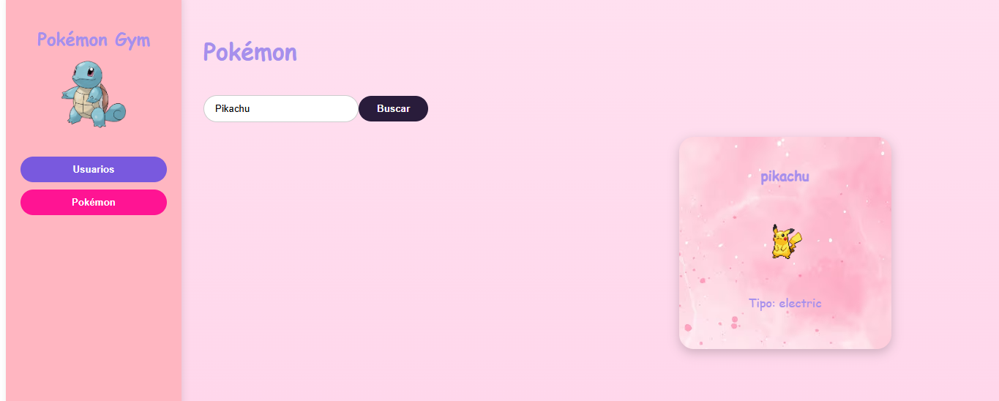

# Pokémon Gym – Frontend Vue 3

Este proyecto es un frontend en **Vue 3** que consume dos APIs:

- **API propia en Laravel** → lista de usuarios.
- **PokeAPI (API pública)** → búsqueda de Pokémon por nombre.

## 🚀 Instalación

1. Clonar el repositorio:
   ```bash
   git clone https://github.com/SeleneRoze/Prueba-t-cnica-Frontend-Vue-Consumiendo-API-Laravel-.git
   cd Prueba-t-cnica-Frontend-Vue-Consumiendo-API-Laravel- (sientete libre de cambiar el nombre de la carpeta)


→Instalar dependencias:
☻bash
→Copiar código: 

npm install 


→ Levantar el proyecto:
☼bash

→Copiar código:
npm run dev
👉 El frontend estará disponible en http://localhost:5173 (o el puerto que indique Vue).

📌 Funcionalidades
🔹 Menú lateral

Logo e imagen decorativa de Pokémon.

Dos botones de navegación:

Usuarios

Pokémon

🔹 Usuarios

Al dar clic en “Usuarios”, se consume el endpoint:

GET http://127.0.0.1:8000/api/users


Se muestran las tarjetas con nombre y correo de cada usuario (generados con seeder en Laravel).

🔹 Pokémon

Al dar clic en “Pokémon”, puedes escribir el nombre de un Pokémon en minúsculas.

Se consulta el endpoint:

GET http://127.0.0.1:8000/api/pokemon/{name}


Muestra una tarjeta con el nombre y la imagen del Pokémon.

🖼️ Screenshots
Vista de Usuarios


Vista de Pokémon



✅ Tecnologías utilizadas

Vue 3

JavaScript (fetch API)

CSS personalizado

PokeAPI (https://pokeapi.co/)

🔗 Repos relacionados

Backend Laravel API : https://github.com/SeleneRoze/Prueba-t-cnica-Backend-API-Laravel-.git

Frontend Vue (este repo) : https://github.com/SeleneRoze/Prueba-t-cnica-Frontend-Vue-Consumiendo-API-Laravel-.git